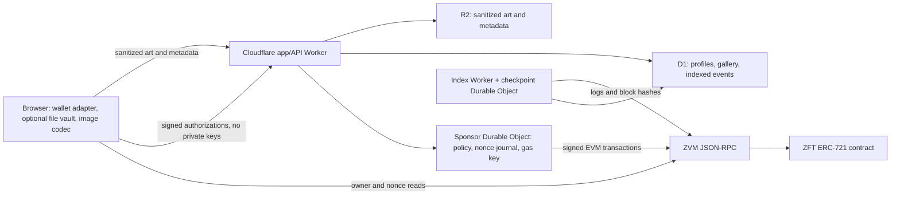

# Cloudflare and application architecture

Architecture design, updated 2026-10-04. Workers/R2/D1 and sponsor/indexer Durable Objects are now provisioned for the hosted devnet alpha. [DEVNET-ALPHA.md](DEVNET-ALPHA.md) records exact deployed resources and behavior. The [complete functional specification](FUNCTIONAL-SPEC.md#12-services-data-and-contracts) lists current API routes and required parity additions. Proposed tables/routes below remain design targets where they differ from code or migrations; they must not be treated as existing endpoints.

## 1. Components and trust boundaries



Recommended frontend: React/TypeScript/Vite SPA served by **Cloudflare Workers Static Assets**. API routes use a TypeScript Worker, with Hono as an optional thin router. One repository/workspace shares chain manifests, schemas, typed-data definitions, file-codec utilities, and error mapping.

Cloudflare does not execute the blockchain or keep ZVM consensus state. The RPC is supplied by a ZVM operator. Initially use the public devnet endpoint, then configure an independently operated secondary endpoint after checking chain/genesis/deployment identity. The browser may read ownership directly; the API also simulates calls before sponsorship.

| Component | Responsibility | Never stores |
| --- | --- | --- |
| Browser vault | Profile/item keys, pending transition journal, local collection | Sponsor private key |
| App/API Worker | Input validation, upload admission, public reads, signed operation forwarding | Vault root, item/profile private keys, transferable-file envelope |
| R2 | Clean art, immutable metadata, optionally public preview variants | V1 recovery bundles or bearer files |
| D1 | Public metadata index, signed profile records, event history, job projections | Private ownership capabilities |
| Sponsor Durable Object | Serialized gas account operations and durable outbox | User asset private keys |
| Index checkpoint Durable Object | One-writer event ingestion cursor and reorg coordination | User keys |

D1 and Cloudflare are replaceable application services. The contract plus a valid item key suffices for an independently submitted ownership rotation. A compromised sponsor can spend its gas balance and censor sponsorship; it cannot choose a different recipient in a valid signed authorization. Malicious served JavaScript can steal unlocked browser keys, which is a separate application supply-chain risk addressed by dependency pinning, restricted CSP, and reviewed releases.

## 2. Repository layout and design target

```text
apps/web/                   React frontend and vault integration
apps/api/                   Cloudflare HTTP API and sponsor routing
apps/indexer/               bounded scheduled event ingestion
packages/protocol/          schemas, EIP-712 types, chain manifests
packages/file-codec/        deterministic image/envelope parsing and golden vectors
packages/vault/             encrypted IndexedDB and recovery bundle codec
contracts/src/ZFT.sol       ERC-721 implementation
contracts/test/             unit, fuzz, invariant suites
contracts/script/           deployment/verification scripts
contracts/interfaces/      review interface (present now)
design/                    dependency-free review prototype (present now)
docs/                      project specifications (present now)
research/                  source references and read-only probe evidence
```

The workspace, pinned dependencies, strict TypeScript, and contract CI are implemented. Indexer code currently lives in `apps/api/indexer.ts`, not a separate `apps/indexer` package; vault, protocol, and codec packages are present. Use `package.json` and the lockfile for exact versions. The standalone prototype deliberately has no runtime dependencies.

## 3. Storage and data model

R2 buckets: `zft-devnet-public` and, later, separately isolated mainnet resources. Public object keys are `art/<imageHash>.<jpg|png>`, `metadata/<metadataHash>.json`, and optional `preview/<imageHash>/<variant>.webp`. Preview transformations apply only to sanitized art, never export files. A public media route is read-only; writes go through the authenticated/limited API. Use first-write, digest-verified immutable objects; metadata edits create a new draft digest before mint and cannot rewrite a minted digest.

Suggested D1 tables:

- `profiles(address PK, display_name, bio, version, signature, updated_at)`.
- `collections(id PK, profile_address, slug, title, visibility, version)` and `collection_items(collection_id, token_id, sort_order, attestation_digest)`.
- `assets(chain_id, contract, token_id, image_hash, metadata_hash, creator, owner, ownership_nonce, mint_block, observed_block, finality, visibility)`.
- `chain_events(chain_id, contract, block_number, block_hash, tx_hash, log_index, event_type, payload, finalized)`; unique event identity.
- `index_checkpoints(chain_id, contract, next_block, checkpoint_hash, finalized_block)`.
- `operations(id PK, authorization_digest UNIQUE, kind, submitted_tx_hash, state, error_code, created_at, updated_at)`; canonical outbox lives in the sponsor DO.
- `upload_reservations(id PK, profile, image_hash, metadata_hash, expires_at, consumed_at)`.
- `follows(actor_profile, target_profile, created_at)` and `likes(actor_profile, target_kind, target_id, created_at)` with unique relation constraints.
- `og_versions(page_kind, page_id, revision_digest, object_key, visibility, generated_at)` for immutable share-image snapshots.

Store token IDs, nonces, and wei values as decimal strings, not JS floats. Retain owner/nonce transitions as replayable events; a reorg can regenerate affected asset projections. The gallery index is not ownership authority.

Unminted private uploads are served only via scoped, expiring admission tokens and become publicly retrievable when the item is minted. Listing/discovery remains optional. Once an NFT’s metadata URI is public on-chain, art confidentiality is not promised. Remove abandoned drafts after 24 hours; preserve objects referenced by minted tokens. No automatic art deletion merely because a profile unpublishes a gallery card.

## 4. API contracts

All state-changing requests have strict schemas, bounded bodies, same-origin checks, operation idempotency and explicit errors. The selected wallet or local profile signs a short-lived single-use challenge bound to origin, identity, method, path and body digest. Wallet auth uses `personal_sign`, validates the returned signature and aborts after account/network/identity changes; no delegated session key is retained. Item consent remains a separate EIP-712 authorization (`eth_signTypedData_v4` in MetaMask). Current atomic challenge consumption shares the Sponsor Durable Object; splitting slow RPC waits out of that boundary remains R7.5. Public wallet-operation journals contain no private keys. Local file sessions use memory or optionally protected IndexedDB; only encrypted persistence has a wrapped root.

| Method / path | Input and behavior |
| --- | --- |
| `GET /api/config` | Public chain/deployment manifest, RPC availability, supported versions, sponsorship policy; client compares security-sensitive fields against bundled allowlists |
| `POST /api/challenges` | Profile address and request purpose; returns random nonce/expiry; rate limited |
| `POST /api/uploads` | Signed bounded upload of canonical art and JCS metadata; hash/format/size checks; returns admission receipt |
| `GET /art/:hash.:ext` | Immutable sanitized bytes; correct MIME and `nosniff`; no user HTML/SVG |
| `GET /metadata/:hash.json` | Immutable JCS metadata bytes; correct digest and cache policy |
| `POST /api/operations/mint` | Mint authorization, signature, upload receipt, idempotency key; validates/simulates/enqueues |
| `POST /api/operations/rotate` | Rotation authorization, signature, profile/device sponsorship proof, idempotency key; validates/simulates/enqueues |
| `GET /api/operations/:id` | Submitted/included/finalized/failed/reorged/expired status and tx hash; no secrets |
| `GET /api/items/:tokenId` | Public metadata/indexed history with observed block and finality labels |
| `GET /api/gallery?cursor=...` | Published items only, stable cursor, bounded page size |
| `PUT /api/profiles/:address` | Signed bounded profile update with optimistic version |
| `PUT /api/collections/:id` | Signed collection update with optimistic version and current possession attestations |
| `PUT /api/follows/:profile` | Signed idempotent follow/unfollow for the requesting profile |
| `PUT /api/likes/:kind/:id` | Signed idempotent like/unlike for a public collection/item |
| `GET /api/profiles/:address/followers` | Paginated public followers; matching following endpoint |
| `GET /api/og/p/:profile.png?v=:revision` | Profile-specific share image; selected item variant includes token ID in path |
| `GET /api/health` | RPC lag, index age, sponsor enabled/disabled state; no credentials or host internals |

V1 file export, file import, recovery export, and vault unlock are **local browser operations** with no upload API. Reject a ZFT envelope detected in an uploaded image; do not provide a generic “upload any file” path. Admission validates the file structurally without executing embedded content. Full canonical byte consistency is pinned by the client codec and fixtures; chain mint consent always binds the resulting actual digest.

Example sponsorship request:

```json
{
  "idempotencyKey": "<random-uuid>",
  "authorization": {
    "tokenId": "<decimal-uint256>",
    "newOwner": "0x<fresh-address>",
    "ownershipNonce": "3",
    "deadline": "<unix-seconds>"
  },
  "signature": "0x<domain-bound-item-signature>",
  "profileProof": "<single-use-request-proof>"
}
```

Success returns HTTP 202 `{operationId, state: "queued"}`. A transport timeout does not mean failure. Resubmit the same authorization digest to discover the existing job before signing another. Suggested stable errors: `UNSUPPORTED_NETWORK`, `UNSUPPORTED_FORMAT`, `HASH_MISMATCH`, `STALE_FILE`, `ALREADY_MINTED`, `INVALID_SIGNATURE`, `AUTHORIZATION_EXPIRED`, `QUOTA_EXCEEDED`, `SPONSOR_UNAVAILABLE`, `CHAIN_UNAVAILABLE`, `TRANSACTION_REVERTED`, `REORG_PENDING`.

## 5. Sponsorship and transaction delivery

Use a dedicated EVM sponsor account with a small devnet balance. Its private key is a Cloudflare secret binding, not in source, R2, D1, client configuration, or logs. The upstream ZVM relayer transports signed EVM transactions into NoM; ZFT’s sponsor pays EVM gas. It does not need each user to hold an EVM gas balance or a native Zenon key. Verify this exact path with a canary before promising onboarding.

The sponsor DO validates the allowlisted contract, method selector, zero call value, chain ID, signatures, current owner/nonce, upload admission, quotas, and maximum gas/fee caps. It never accepts arbitrary target/calldata or a “send funds” action. Simulate the contract call before reserving gas budget. Set per-request, per-profile/device, and global daily limits. IP-based abuse keys should be salted/short-lived, not a durable browsing profile. Turnstile is an optional escalation for suspicious mint volume, not a mandatory third-party script on vault/claim screens.

DO event handlers can interleave around awaits; use durable transactional state plus a deliberate serialized delivery queue, not an assumption that every async handler runs to completion in order. Journal `{authorizationDigest, txNonce, signedRawTx, txHash, gasBudget, state}` before broadcast. A crash or timeout must retry the exact signed transaction. A replacement uses the same tx nonce and same authorized call with bounded fee bumps; track all replacement hashes. Never reset to `pending` nonce without reconciling the existing journal, and never skip unknown nonce gaps by inventing a replacement call. Persist the new recipient key in the browser independently of this outbox.

Quota exhaustion disables sponsorship, not ownership. V1 offers a portable signed authorization for advanced independent submission; a polished self-funded client is a later milestone. The sponsor cannot guarantee availability or inclusion speed. Show the current limit/availability before the user signs.

## 6. Inclusion, finality, indexing, and resets

Current devnet reports a six-momentum finality depth. This is an observed devnet parameter, not a hard-coded production guarantee. Prefer the documented ZVM finalized block signal after validation; if only configured confirmation depth is available, label it as the app’s confirmation policy and do not call it protocol finality.

The indexer reads bounded log ranges starting at the approved deployment block. It verifies chain ID/genesis and checkpoint ancestry. Store block hashes for the unfinalized window; on divergence, rewind affected events and projections, mark affected jobs `reorged`, and reconcile receipt/owner/nonce. A cron-triggered Worker wakes ingestion; a checkpoint DO serializes overlapping scans and schedules bounded continuations. Index lag is visible in health and the frontend.

Devnet resets are detected by genesis/deployment identity, not just block height. Stop signing/submitting for the old deployment and retain old files/vault records read-only. A reset does not silently remint assets or interpret old files on a new contract. Reissue requires explicit user action under the new manifest.

## 7. Hosting and deployment

Use Workers Static Assets for the app, with Worker-first routing for APIs/media and all public share routes. **Page-specific social metadata is a v1 requirement**, not a later enhancement: the Worker uses HTMLRewriter to inject title, canonical/OG/Twitter tags and public bootstrap data into the initial HTML for `/p/:profile`, profile-selected artwork queries, `/item/:tokenId`, and public collection pages. All visitors receive the same head metadata; do not rely on browser JavaScript or bot-only rendering. The SPA mounts into that shell. See `PAGES-AND-SHARING.md` for OG generation/cache behavior. Confirmed custom domain: **`zft.foo`**. The user reports it is set up on Cloudflare; verify zone ownership, DNS, and Worker routing during provisioning. The earlier `zvm.foo` message was corrected by the user and must not appear in deployment configuration.

Separate environments: local, devnet preview, devnet beta, then an independently approved mainnet configuration. Each uses isolated D1/R2/DO namespaces and sponsor keys. Preview builds must not use the public beta sponsor or buckets. Deploy from GitHub Actions with least-privilege Cloudflare API credentials in repository/environment secrets and scoped environment approvals for live resources.

The deployed resources and non-secret IDs are in `wrangler.devnet.jsonc`; the legacy prototype uses the root Wrangler configuration. The real app is at `devnet.zft.foo`; the apex root remains the prototype, with real `/art/*` and `/metadata/*` routes. Apex promotion remains a separate routing/release step. Secrets use Cloudflare secret management, never committed config.

## 8. Operational controls and budgets

- Strict CSP: self-host app/fonts/assets, no third-party analytics on secret-handling routes; no inline executable code in the production frontend. The standalone review prototype is not the production CSP baseline.
- HTTPS, secure headers, MIME sniffing protection, narrow CORS, plain-text escaping, and no arbitrary image URL fetches. HTML/SVG uploads are excluded.
- Logs redact authorization payloads, raw transactions, file data, recovery material, keys, and URL fragments. Log operation ID/error category/hash only when needed.
- Monitor RPC reachability, chain/deployment identity, sponsor balance, nonce queue age, global gas budget, index lag/reorg count, request errors, and R2 storage growth.
- Roll back an app version through Cloudflare deployments; keep schemas backward-readable. An immutable contract cannot be rolled back; defects require an explicit new-deployment plan.
- Emergency response can disable upload admission/sponsorship and display incident status without adding a token seizure mechanism.
- Budget consists of Cloudflare request/CPU usage, D1 reads/writes/storage, R2 storage/operations, domain costs, external RPC, and sponsor gas. Set a monthly Cloudflare cap/alert target during provisioning and a separate on-chain daily gas cap. No fixed monthly bill is promised before load measurements and plan selection.

Official references: [Workers Static Assets](https://developers.cloudflare.com/workers/static-assets/), [storage choices](https://developers.cloudflare.com/workers/platform/storage-options/), [R2 Worker API](https://developers.cloudflare.com/r2/api/workers/workers-api-reference/), [Durable Object concurrency rules](https://developers.cloudflare.com/durable-objects/best-practices/rules-of-durable-objects/).
