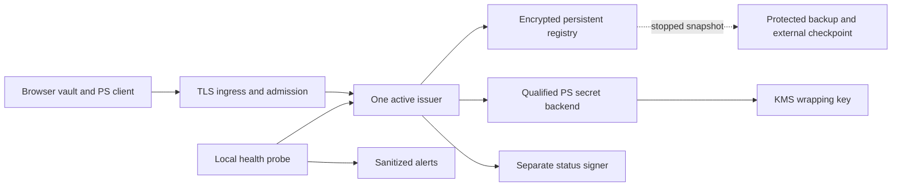

# PS hosting and key-custody proposal

Status: proposed, October 9, 2026. Engineering baseline: merged [PR #25](https://github.com/0x3639/zft/pull/25), `f3bb3bfcb8d4e60344a33dfaea6fd5d5bf3a0c27`; its reviewed implementation head is `0963bf06602260a08934a8a1ff847beaef4d351a`. Their tracked trees are identical. This document defines the next implementation work; it does not select an account, provision resources, approve custody or authorize staging. Provider documentation was checked on the date above.

## Recommendation and decisions still needed

Use a dedicated Linux VM with one active issuer and a persistent encrypted block volume as the initial design target. AWS EC2, EBS and KMS are the recommended reference platform because that arrangement retains the current process and filesystem model while providing a path to managed encryption and a separate status signer. This is an engineering fit assessment, not an account, cost or availability commitment. Cloudflare can remain the existing application host; the PS client and API should initially share a separate staging origin.

Do not expose the current loopback server through a tunnel or change its listen address as a hosting shortcut. First implement and review a separate hosted boundary, production secret-operation backend, state recovery policy and admission identity. The frozen local profile remains a reference. Independent C1/C4 review and [PS-OWN-01](PS-REVIEW-PACKET.md#open-review-item-former-holder-and-cross-asset-forgery) remain release gates before a hosted experiment or real assets.

| Decision          | Proposed position                                                        | Required owner input or evidence                                                                       |
| ----------------- | ------------------------------------------------------------------------ | ------------------------------------------------------------------------------------------------------ |
| Hosting           | Dedicated single-writer Linux VM; AWS reference design                   | User selects provider/account, region, budget ceiling and resource owner; none assigned                |
| Availability      | Planned downtime and manual recovery for first isolated canary           | Operator approves outage expectations and demonstrates fencing; no active-active or automatic failover |
| Secret execution  | Qualified PS backend; KMS-backed encryption for stored secrets           | Independent review of the backend, actual build and threat model; no qualified backend selected        |
| Status signatures | Evaluate managed Ed25519 separately                                      | Exact transcript, size, public-key encoding and failure tests; no KMS integration implemented          |
| Restore safety    | Suspend whenever acknowledged state or old-writer exclusion is uncertain | Reviewer-approved freshness procedure and operator evidence                                            |
| Release           | Disposable test assets, named participants and bounded canary            | Independent review, device evidence and explicit staging-owner approval                                |

A provider decision can change this proposal before implementation. No cloud credentials, issuer keys, private state, wallets or user downloads were inspected for it.

## Runtime constraints from the merged code

These are implementation observations, not provider claims:

- [Persistent initialization](../research/ps-lab/local/persistent.mjs) writes plaintext PS scalars and an Ed25519 private key to `private.json`. Public pins, the ready marker, port and role identifiers bind the local instance.
- [The issuer](../research/ps-lab/local/issuer.mjs) also retains secret session scalar `k` in SQLite. Protecting only `private.json` leaves secret material in the database, journals and backups.
- [The store](../research/ps-lab/local/store.mjs) uses synchronous `node:sqlite`, local filesystem permissions and `BEGIN IMMEDIATE`, with DELETE journaling and FULL synchronization. [Offline snapshots](PS-LOCAL-OPERATIONS.md) stop the service and copy both databases under exclusive ownership.
- [PS response computation](../research/ps-lab/local/profile.mjs) uses custom BLS12-381 scalar/group operations involving `x`, `yh`, `ys` and `k`. The source explicitly leaves BigInt secret operations unqualified for production side channels. Browser proof generation has its own secret-operation review requirement.
- [The server](../research/ps-lab/local/browser-server.mjs) derives trust/audience and response URLs from an exact loopback origin. A shared process launch capability and Alice/Bob/Restored roles serve one operator; these are not hosted multiuser admission controls.
- [Status receipts](../research/ps-lab/local/state.mjs) and [backup checkpoints](../research/ps-lab/local/persistent-ops.mjs) use the same separate Ed25519 status key and different domain-framed messages. Their current synchronous key-object calls are not a remote-signer interface.

The current admission caps and 16 MiB database page limits are research bounds. Hosting does not enlarge them or establish production capacity. Missing state must continue to fail closed; startup must never initialize a replacement issuer implicitly.

## Platform comparison

| Option                                  | Verified capability                                                                                                                                                                                                                                                                                                    | Consequence for PS                                                                                                                                                                                                                         |
| --------------------------------------- | ---------------------------------------------------------------------------------------------------------------------------------------------------------------------------------------------------------------------------------------------------------------------------------------------------------------------- | ------------------------------------------------------------------------------------------------------------------------------------------------------------------------------------------------------------------------------------------ |
| AWS EC2 with encrypted EBS and KMS      | EBS supports KMS-encrypted volumes and snapshots, including encryption between the instance and attached storage. [EBS documentation](https://docs.aws.amazon.com/ebs/latest/userguide/ebs-encryption.html)                                                                                                            | Best reference fit for the existing Node/filesystem model. Disk encryption does not prevent a privileged process from reading mounted data. The operator still owns patching, backups and recovery.                                        |
| Fly Machines with Volumes               | Volumes are local persistent storage, tied to one host and Machine; replication is not automatic. Provider snapshots can lag and are not recommended as the sole backup. [Volume documentation](https://docs.fly.io/volumes/overview)                                                                                  | Feasible alternative for a canary that accepts downtime. Adding a second Machine does not safely replicate issuer state or exclude concurrent writers. Custody and checkpoint design remain required.                                      |
| Cloudflare Workers with Durable Objects | Workers filesystem writes are temporary/in-memory. Durable Objects offer persisted SQLite through their own storage and transaction APIs. [Filesystem](https://developers.cloudflare.com/workers/runtime-apis/nodejs/fs/), [SQLite storage](https://developers.cloudflare.com/durable-objects/api/sqlite-storage-api/) | A separate backend port, not a deployment of the current local files. `BEGIN IMMEDIATE`, locks, snapshots, secret execution and recovery need new implementations and evidence. Defer this port; preserve the current Worker and bindings. |

No prices or instance sizes are selected. Estimate compute, storage, backup retention, KMS requests, network and operator costs in the chosen region after measured workload bounds exist. Recheck provider support and quotas then.

## Proposed service boundary

The diagram is a target architecture, not deployed infrastructure. An approved ingress terminates TLS for one dedicated PS staging origin. It serves a pinned product build and a new authenticated API on that origin; only the issuer has write access to its registry. The existing devnet/apex routes stay outside this proposal.

The API must validate one configured external origin and allowed host, remove untrusted forwarding headers at the ingress, and trust proxy metadata only from that ingress. Backend access must be restricted independently. Arbitrary Origin reflection and wildcard CORS are unacceptable. Tests must cover spoofed Host/forwarded headers, duplicate security headers and direct backend access. Current loopback checks remain intact in the local product.

Replace the shared launch capability with short-lived authenticated participant sessions and explicit issuer admission policy. Operator administration uses a separate role and route boundary. If cookies are used, require Secure/HttpOnly/SameSite policy and explicit CSRF defenses. An operator identity or wallet endorsement does not confer bearer spend authority. Keep wallet identity integration separate from the PS proof and exact recovery capability.

Retain request bounds and add admission/rate/concurrency limits before expensive proof work. Separate expensive work from connection handling with an explicitly bounded execution model. Keep full proof verification before any authoritative state change; rate limits cannot replace it. Do not log request bodies, authorization headers, recovery capabilities, private files or signer payloads at ingress, application or telemetry layers.

Public evidence remains an opt-in historical report with explicit disclosure and retention policy. Its artwork, proof and timestamps do not become current-ownership statements. Health remains private and separate from participant/administrative authorization. A remote alert collector receives only approved aggregate fields, never `monitor.json` or the state directory.

## Custody and secret-operation design

### Separate the key roles

| Material                            | Proposed boundary                                                                                      | Required compatibility and failure evidence                                                                                               |
| ----------------------------------- | ------------------------------------------------------------------------------------------------------ | ----------------------------------------------------------------------------------------------------------------------------------------- |
| Long-lived PS `x`, `yh`, `ys`       | Independently qualified PS backend; encrypted persisted representation with narrowly authorized unwrap | Public manifest equality, hostile-input proof validation, scalar/point constraints, secret-operation assessment and no plaintext fallback |
| Per-session `k`                     | Protected durable state with the same session binding and recovery semantics                           | Restart/expiry/replay, crash between creation and persistence, no unintended reuse, and no re-generation to repair missing state          |
| Ed25519 status/checkpoint key       | Evaluate separate managed signer, pinned to a full key identity and public key                         | Exact original domain bytes, canonical response encoding, receipt and backup verification, denied/throttled/timed-out requests            |
| Storage/backup wrapping keys        | Separate access policy from signing; restore/deletion privileges assigned explicitly                   | Wrong realm/keyset/version/context rejects; ciphertext tampering, unavailable unwrap and retained-backup restoration                      |
| Client owner secrets and vault keys | Browser-owned flow and selected recovery files                                                         | Independent browser secret-operation assessment and real-device lifecycle acceptance; issuer hosting cannot qualify this boundary         |

AWS KMS's published key specifications and signing algorithms do not expose these custom PS operations. That rules out replacing `issueResponse` with a documented KMS `Sign` call. This is an inference from the local equations and the [KMS key-spec reference](https://docs.aws.amazon.com/kms/latest/developerguide/symm-asymm-choose-key-spec.html), not a claim about every HSM or custom service.

KMS currently documents Ed25519 (`ECC_NIST_EDWARDS25519`, `ED25519_SHA_512`, `MessageType:RAW`). It is a candidate for the separate status role. Its [Sign API](https://docs.aws.amazon.com/kms/latest/APIReference/API_Sign.html) bounds input to 4096 bytes. Prove every permitted framed receipt and snapshot fits that bound; reject oversized inputs. Do not substitute a prehash or different algorithm to fit. Verify returned signatures with the existing public verifier and explicitly test public-key conversion and pinning. No compatibility result is claimed yet.

KMS can protect a data key used to encrypt secret records; [data keys can be returned in plaintext to the caller](https://docs.aws.amazon.com/kms/latest/developerguide/concepts.html). After unwrap, an ordinary process has access to plaintext. Envelope encryption therefore improves stored-secret protection without establishing non-exportable PS keys, constant-time execution or resistance to a compromised host.

A production adapter must use a versioned, bounded encrypted record binding realm, keyset, public manifest and configuration identity. Specify exact AEAD encoding and nonce lifecycle in that implementation's review. Refuse wrong keys/context, malformed records and unavailable unwrap; do not create new issuer identity or write a decrypted `private.json` as fallback. Avoid command-line/environment secrets, core dumps, debug payloads and plaintext temporary files. Memory erasure and swap behavior require measured platform-specific evidence; JavaScript garbage collection cannot supply a zeroization guarantee.

### Qualified execution is a separate gate

No BLS library, HSM or native/WASM backend is selected or approved by this document. Qualification must cover secret multiplication, randomness, invalid-point handling, compiler/build behavior, memory exposure, side channels and independent malicious vectors. Preserve reference equations and wire formats until an independently reviewed replacement passes exact interoperability and failure tests. A different language, backend or successful test vector alone is insufficient.

An enclave is an optional later execution boundary if the threat model requires protection from the host administrator. [Nitro Enclaves](https://docs.aws.amazon.com/enclaves/latest/user/nitro-enclave.html) provide isolated compute and attestation but have no persistent storage or external networking. A design would need authenticated parent communication, durable session handling and rollback analysis. An enclave does not itself prove the PS protocol, constant-time code or freshness. No enclave implementation is part of this increment.

### Preserve commit-before-response behavior

Remote custody changes the synchronous execution model. The current issuer computes a response and then atomically commits the unique spend/reservation and exact recoverable response before returning it. A future adapter must keep that invariant through asynchronous signing, deadlines and process failure:

1. Parse and verify the complete request and its pinned scope before invoking secret work; authorize the request and bind its digest/session.
2. After asynchronous work, recheck session, expiry, admission and concurrent winner inside the authoritative transaction. Discard a losing result; do not return it or expose a general-purpose signer to clients.
3. Persist the exact accepted response with the spend/reservation atomically, then release it. After ambiguous failure, recover the committed operation rather than regenerating a request or assuming it failed.
4. For status receipts, define the observation snapshot and durable replay boundary across the remote call. Reuse the exact committed historical receipt; never relabel a delayed signature as a fresh observation.

Crash, denial and timeout tests must cover each new boundary. They require a new adapter and review, not merely replacing a `sign()` call with `await` in the frozen reference code. Signer access does not prove registry freshness; a compromised caller or issuer remains a distinct threat.

## One writer, backups and recovery

One active issuer is a deployment constraint, not proof of distributed exclusion. Disable automatic cloning, autoscaling and automatic restore activation for the initial canary. A replacement must remain unable to admit work until an operator has excluded the previous writer and reviewed the exact retained state. Removing DNS or revoking future unwrap does not erase keys already in memory or stop an old process.

The fencing design must identify who can stop/isolate the old compute and storage, how completion is independently established, and how a new writer is prevented from starting on uncertainty. A local PID lock, copied lease file, cloud instance name or expired health sample is insufficient. If automatic failover is later required, it needs an independently reviewed authority boundary that rejects stale writers, plus partition and delayed-request tests. That mechanism remains unimplemented.

Use the existing stopped, consistent backup as the local semantic reference. Encrypt the entire backup, including session secrets and any plaintext key material, before transfer. Keep its expected checkpoint in an independent operator record with access controls separate from the backup writer. Record upload completion and verify a download/restore drill; a locally signed snapshot or provider snapshot alone does not prove freshness.

For the same issuer identity, safe restore requires accounting for every acknowledged operation since the checkpoint. A periodic backup can be authentic and still omit a later spend. An off-host checkpoint hash can detect a known mismatch but cannot reconstruct missing responses or prove there was no later write. Do not promise a nonzero data-loss window followed by safe automatic resume. If latest authoritative state cannot be established, keep admission suspended and invoke the reviewed incident/retirement policy. An independently durable commit/recovery design would be additional engineering, not a property of this VM proposal.

Define backup retention, client recovery availability, public-record removal and admission capacity before hosting. Do not delete spent markers, operation responses or session records merely to relieve pressure. Wrapping-key rotation must retain the ability to restore retained backups; deleting a wrapping key is destructive. PS/status-key replacement changes trust and requires explicit pin distribution and retirement policy. It does not repair forged signatures or migrate existing credentials automatically.

## Operational acceptance

The health probe is an input to monitoring. Add external process/host metrics, free storage, backup age and actual alert delivery only after owners and destinations are selected. Redact identifiers beyond the agreed aggregate schema. Maintain a separate authorized administrative path and a tested way to suspend admission during incidents. A healthy process is not cryptographic approval or safe restore evidence.

Before selecting machine sizes or promising latency, measure representative valid and hostile workloads, event-loop delay, worker/queue limits, memory and disk growth, signing latency/throttling and exact recovery at admission caps. Set budgets from those measurements. Canary stop conditions include invalid/missing state, unexpected issuer identity, unverified writer exclusion, failed backup verification, persistent overload and loss of required custody access. Alerting must not auto-resume, prune, rotate keys or launch a replacement.

## Implementation sequence and review exits

Each increment needs its own signed candidate, focused regressions, current source evidence and completed PR review. This ordering refines the [release sequence](PS-RELEASE-PLAN.md); it does not close existing external gates.

| Increment                                      | Concrete deliverable                                                                                                                  | Exit before proceeding to dependent work                                                                                                  |
| ---------------------------------------------- | ------------------------------------------------------------------------------------------------------------------------------------- | ----------------------------------------------------------------------------------------------------------------------------------------- |
| A. Provider and custody contract               | Chosen account/region/budget/owner; explicit custody threat model; separately scoped status and PS interfaces                         | User/provider decision plus reviewer agreement on threat assumptions; no provisioning                                                     |
| B. Local adapter experiments                   | New isolated custody interfaces and denied/timeout/malformed-response simulations, without modifying frozen protocol files            | Exact transcript/pin compatibility, no plaintext fallback, restart and commit/recovery regressions; clearly label mocks as local evidence |
| C. Qualified secret backend                    | Reviewed implementation/build for issuer and browser secret paths, with independently authored adversarial vectors                    | Independent C1/C4 report and PS-OWN-01 disposition for the candidate; no self-certification                                               |
| D. Hosted boundary and operations              | Participant/admin identity, exact origin/proxy policy, durable state/custody integration, fencing and protected backup/alert adapters | Failure/partition/restore tests, measured limits, named on-call and approved retention/incident procedure                                 |
| E. Device acceptance and staging configuration | Real target-device reports; resource plan, secrets/IAM policy, domain, artifact, canary and rollback runbook                          | Explicit staging approval and required external gate evidence; deployment is a separate action                                            |
| F. Staging canary and limited release          | Real staging smoke/recovery evidence, reviewed canary results and release decision                                                    | All required targets and exact-candidate reports; public/apex promotion needs separate approval                                           |

The first staging authorization remains subject to the existing [preflight gates](PS-RELEASE-PREFLIGHT.md), including target-device evidence. Local/device preparation can run earlier; additional staging acceptance does not waive the pre-staging device gate. No phone/extension acceptance has been added here.

An independent reviewer can use the existing [review packet](PS-REVIEW-PACKET.md) with the exact source revision and this proposed scope. Reviewer assignment and outreach remain pending. Increment B's provider-neutral local contract experiments can proceed while the provider decision is pending, with provisional interfaces and no cloud access. Provider integration depends on increment A and the relevant review gates. No production service or backend choice is silently approved by merging this document.

## Evidence boundary for this increment

This is a documentation-only proposal. It preserves every previously tracked file, including `research/ps-health-validation.json`, the frozen reference, current release checker/template, app, Worker, dependencies and all prior validation records. Its addition is fixed by its signed Git commit; it is not silently added to the health manifest or represented as qualified deployment evidence.

Validation for this document consists of checking repository links and cited primary provider documentation, verifying the 140 existing health source hashes still match, checking the baseline tree, and reviewing the proposed boundaries. No new runtime, browser, cloud, load, durability or cryptographic tests are claimed. PR #25's 266 local tests, 78 mutation controls and green CI remain evidence for that unchanged implementation only.

The release checker still uses its previously reviewed baseline and fixed health manifest. Before any later implementation candidate can pass release preflight, deliberately advance the reviewed baseline/manifest and collect new exact-candidate signatures, CI/review results and external reports. Do not alter historical manifests or label the old PR's checks as approval of this proposal.
